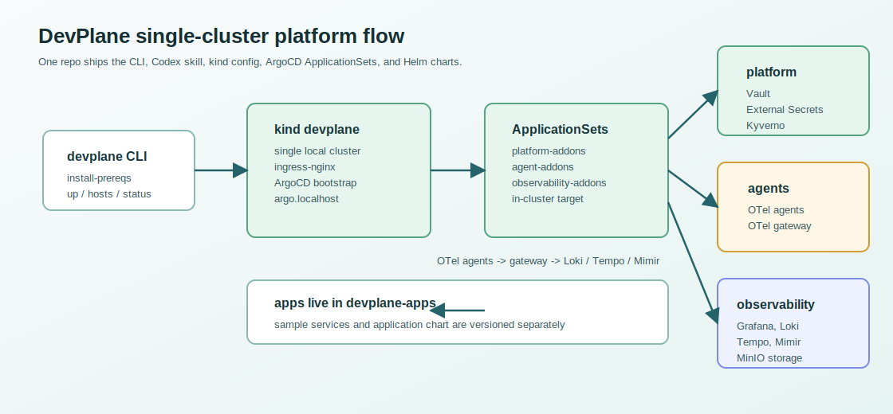

# DevPlane

DevPlane e uma base local de plataforma para desenvolvimento em kind/local, empacotada para uso via CLI e GitOps.

## Modelo

O DevPlane e autocontido: os charts Helm ficam neste repositorio em `charts/`, e o ArgoCD aplica tudo por ApplicationSets.



## Estrutura

```text
charts/
├── platform/
│   ├── argocd/
│   ├── ingress-nginx/
│   ├── vault/
│   ├── external-secrets/
│   └── kyverno/
├── agents/
│   ├── opentelemetry-collector/
│   └── vector/
└── observability/
    ├── grafana/
    ├── loki/
    ├── tempo/
    └── mimir/
clusters/
gitops/applicationsets/
scripts/
skills/
docs/
```

## Instalar CLI E Pre-Requisitos

Depois de clonar o repositorio:

```bash
make install-cli
devplane install-prereqs
```

`install-prereqs` e idempotente: se `git`, `make`, `docker`, `kubectl`, `helm` ou `kind` ja existirem, ele ignora.

Para instalar como pacote a partir do GitHub, incluindo a skill do Codex:

```bash
curl -fsSL https://raw.githubusercontent.com/gleydsoncavalcanti/devplane/main/packaging/install.sh | bash
```

Isso instala:

- CLI `devplane` em `~/.local/bin`;
- skill em `~/.codex/skills/devplane`;
- repo em `~/.devplane/devplane`.

## Subir Plataforma Local

```bash
devplane up
```

O comando cria o kind cluster, instala o bootstrap minimo `ingress-nginx` e `argocd` usando os charts empacotados em `charts/platform/`, e aplica os ApplicationSets em `gitops/applicationsets/`.

Depois do bootstrap, o proprio ArgoCD reconcilia:

- addons de plataforma: ArgoCD, ingress-nginx, Vault, External Secrets e Kyverno;
- agentes: OpenTelemetry Collector e Vector;
- profile de observabilidade: Grafana, Loki, Tempo e Mimir.

## Telemetria

O fluxo padrao de telemetria e:

```text
OpenTelemetry Collector -> Vector -> Loki / Tempo / Mimir
```

- OpenTelemetry Collector coleta logs, metricas e traces e encaminha para Vector via OTLP.
- Vector recebe logs, metricas e traces, e envia para os datastores.
- Loki recebe logs.
- Tempo recebe traces.
- Mimir recebe metricas.
- MinIO e usado como armazenamento de objetos para a stack de observabilidade onde suportado pelos charts.

Use Mimir para metricas. Nao use Prometheus/kube-prometheus-stack no baseline de workloads.

## Workload Clusters

```bash
devplane cluster generate runtime
devplane cluster add runtime
devplane cluster workloads
devplane cluster remove runtime
```

Clusters de workload devem ser registrados no ArgoCD com:

```yaml
devplane.io/workload: "true"
```

Assim eles recebem os ApplicationSets de agentes e observabilidade.

## Dominios Locais

```bash
devplane hosts
```

O comando atualiza o bloco gerenciado do DevPlane em `/etc/hosts` com:

- `argo.devplane`
- `vault.devplane`
- `grafana.devplane`

## Comandos Uteis

```bash
devplane status
devplane cluster appsets
devplane down
```

KEDA e Karpenter nao fazem parte da instalacao local neste momento.
